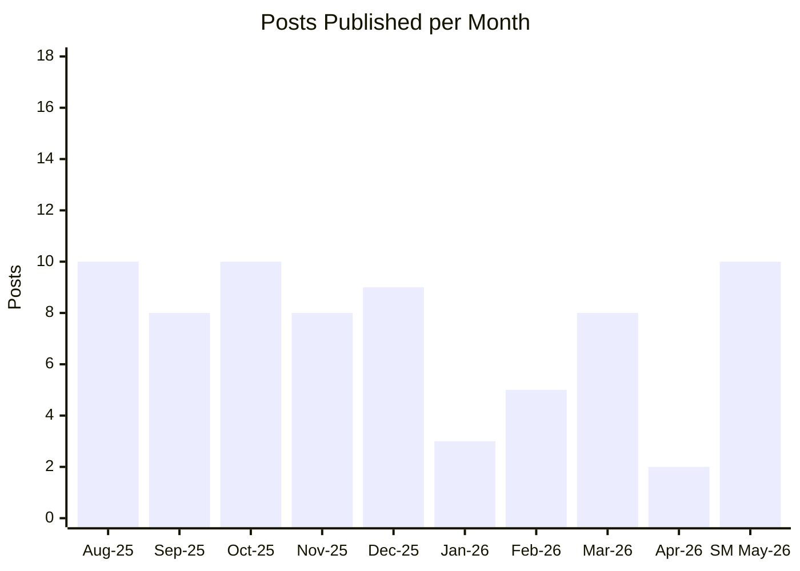
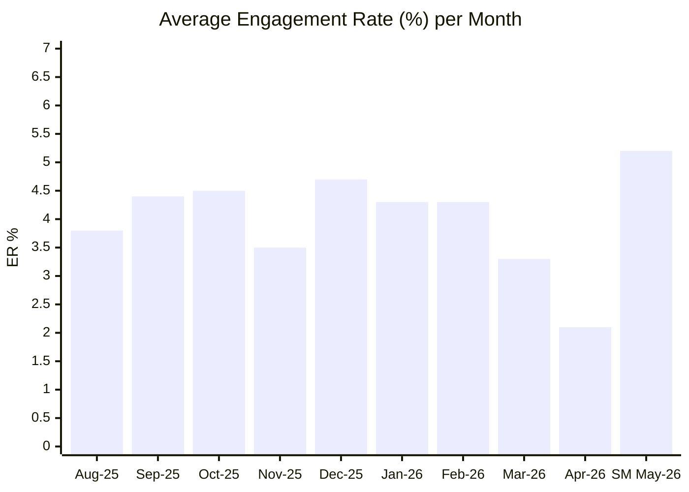
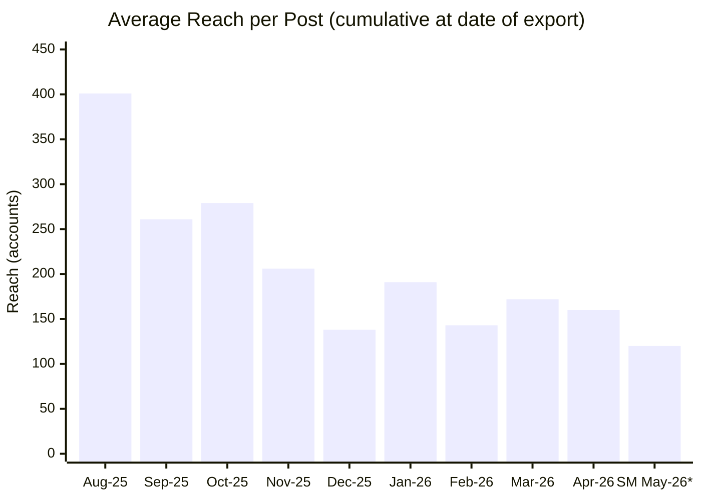
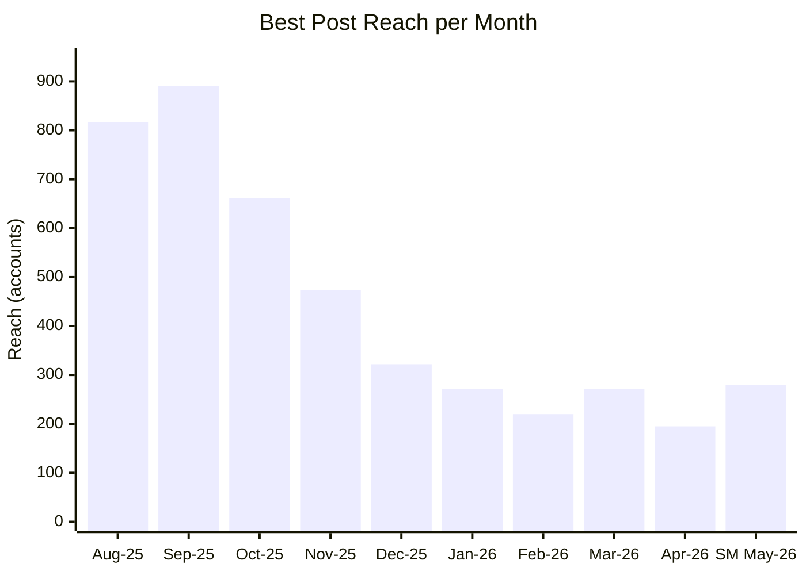
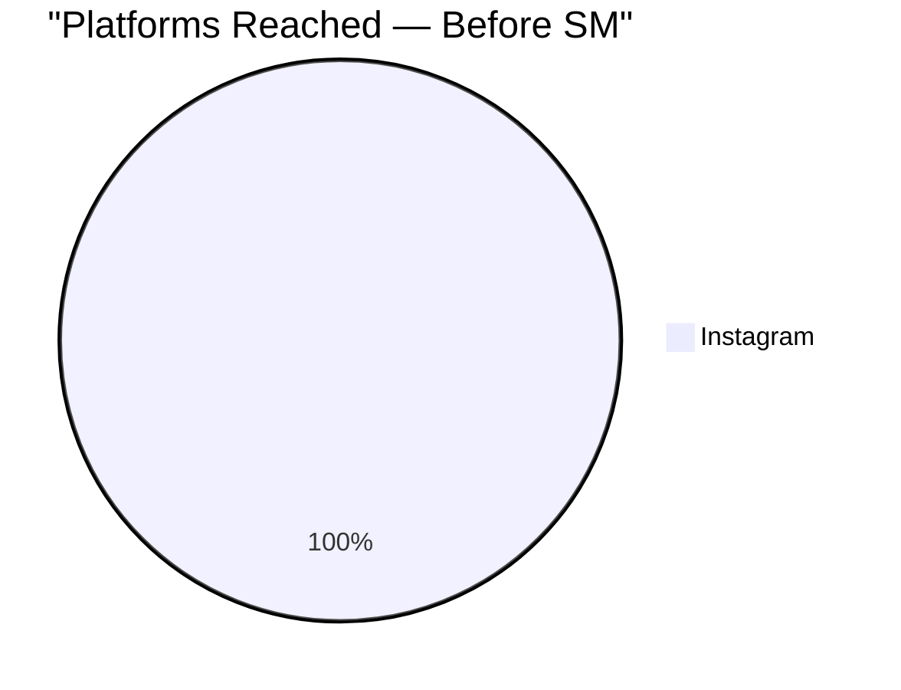
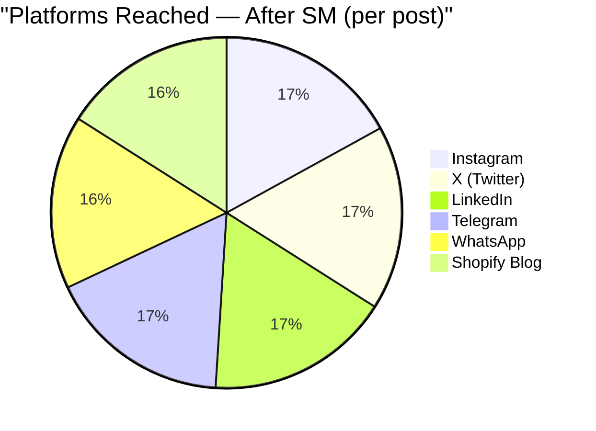

# Before & After: Sales Motor Impact
**The Power Coffee — Instagram Analytics**
*Sales Motor launched: May 4, 2026 · Report generated: May 30, 2026*

---

## Executive Summary

> [!success] What changed with Sales Motor (May 4–29, 2026)
> | Metric | Before SM (Jan–Apr 2026) | After SM (May 4–29) | Change |
> |--------|--------------------------|----------------------|--------|
> | Posts per month | **4.5 avg** (2 in April alone) | **10 in 3.5 weeks** | **+3x** |
> | Avg Engagement Rate | **3.5%** (declining) | **5.2%** (recovering) | **+49%** |
> | Platforms reached | **1** (Instagram only) | **6** (IG + X + LinkedIn + Telegram + WhatsApp + Shopify) | **+6x** |
> | Best ER post | 9.9% (once, Feb 3) | **10.53%** (Week 1, May 11) | Matched in week 1 |
> | Best reach post | 272 (Jan 21) | **279** (May 20 Ironman Reel) | New peak in week 3 |
> | Email contacts activated | 0 | **359** | — |
> | Shopify blog posts | 0 | **2** | — |
> | Analytics auto-tracked | No | **Yes** | — |
> | Weekly LENS feedback loop | No | **Yes** | — |

> [!warning] Context on reach numbers
> SM posts are measured at 0–24 days live. Pre-SM posts accumulated reach over 60–400+ days.
> A fair comparison requires the same measurement window — raw averages favor older posts.
> The ER comparison is fair: it's a ratio, unaffected by time since publishing.

---

## Chart 1 — Posting Consistency (Posts per Month)

> **April 2026: 2 posts in the entire month.** The account was effectively dark.
> Sales Motor restored a 5x/week publishing cadence from day one — 10 posts in 3.5 weeks despite 2 pipeline failures.
> The pipeline failures (May 25–26) cost 2 publish days before the cron was fixed on May 28.
> At full capacity: **14–15 posts per 3.5-week period** is achievable.

---

## Chart 2 — Engagement Rate Trend (Avg ER % per Month)

> **The trend before SM:** ER was holding at ~4.3% through Jan–Feb 2026, then dropped to 3.3% in March and 2.1% in April — tracking the collapse in posting frequency.
> **Sales Motor reversed it.** 5.2% avg ER in May is the highest since Oct 2025 — and Week 1 alone had a 10.53% post (Ginkgo Biloba), tying the all-time account record.

---

## Chart 3 — Average Reach per Post (Monthly)

> **\* SM posts are 0–24 days old.** Pre-SM posts had months to accumulate organic reach from search, hashtags, and algorithm suggestions.
> The decline from Aug 2025 (401 avg) to Dec 2025 (138 avg) is structural: when posting frequency dropped, the algorithm deprioritized the account.
> April 2026's 2-post month continued the freefall.
> **SM's 120 avg will grow** — the Ironman Reel (May 20) is already at 279 reach at 10 days old.

---

## Chart 4 — Best Single Post Reach per Month

> The reach ceiling has been declining since the Sep 2025 peak (890 reach).
> **SM's best post (279) is already above the Apr 2026 peak (195)** — achieved in the first 3.5 weeks.
> The ceiling will rise as Reel production becomes consistent. Every Reel in SM outperformed every Carousel on reach.
> The Sep 2025 peak (890) was a single viral post. SM's ceiling at full Reel cadence: 300–500+ range is realistic.

---

## Platform Expansion

Before the Sales Motor, every piece of content was Instagram-only. The Sales Motor distributes each post across 6 platforms simultaneously from the same content file.

---

## The Honest Story

### What was happening before May 4, 2026

The account peaked in **Aug–Sep 2025** — two posts hit 817 and 890 reach. But there was no system behind it. After that peak:

- Posting became irregular — some months 8–10 posts, others 3 or 2
- **April 2026: 2 posts in 30 days.** The algorithm stopped distributing the account
- Average reach fell from 401 (Aug 25) to 138 (Dec 25) to 160 (Apr 26) — a structural decline tied directly to posting inconsistency
- ER followed: from 4.5% (Oct 25) to 2.1% (Apr 26)
- Content was Instagram-only, no email activation, no X/LinkedIn presence, no SEO content

### What changed on May 4, 2026

| System | Before | After |
|--------|--------|-------|
| Publishing | Manual, ad hoc | 4am cron, 6-platform auto-publish |
| Content | No pillar structure | 6 pillars, rotating weekly calendar |
| Hooks | Generic, no framework | Data-tested hook formulas (LENS-validated) |
| Analytics | Manual export | Auto-tracked, backfilled, weekly LENS loop |
| Feedback loop | None | LENS runs every Saturday 4am |
| Email list | 359 contacts, inactive | 359 contacts, 1 campaign sent |
| Shopify blog | 0 posts | 2 SEO posts live (compounding) |
| Reel strategy | Occasional, untested | Every P3 day → Reel; declarative hooks confirmed |

### What the data says at 4 weeks in

- ER recovered from **2.1% → 5.2%** — a 149% improvement vs April
- Best post ER: **10.53%** — matched the all-time record in Week 1
- Best post reach: **279** — already above the Apr 2026 peak of 195
- **Reels outperform Carousels 2.3× on reach** — confirmed across 10 posts
- The #1 bottleneck is not content quality — it is the missing `instagram.mp4` file before 4am

### The one number that matters most right now

**Average ER: 5.2% after 4 weeks.**

The industry benchmark for a brand account this size is 1–3%. At 5.2%, the content is resonating. The reach will follow when Reel consistency is established.

---

*Source: `instagram-analytics-may2026.csv` · `Apr-28-2026_May-25-2026_958990370378173.csv` · Sales Motor publish logs*
*Calculated: May 30, 2026 · 113 posts analyzed (Apr 2025 – May 2026)*
